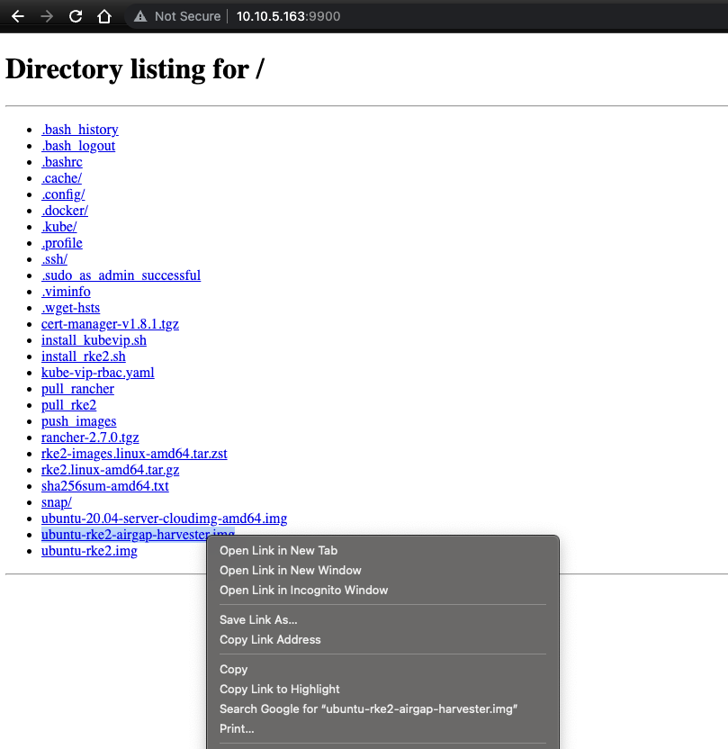
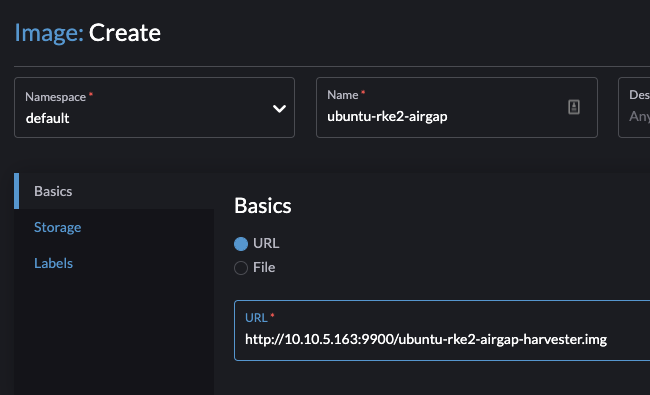
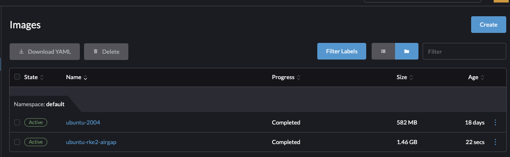

# Airgapping made easy with RKE2 and Rancher

## Intro

## Use Case and Scope
* Hard Way
* Easy Way

### What is an AirGap?
* Soft
* Hard

## Prereqs
* Infrastructure on which to deploy (we use Harvester here, but just about anything works) and that infra being configured.
* Linux or MacOS terminal with airgap access
* DHCP (static is possible, but adds extra provisioning steps)
* DNS
* Image Store (we use Harbor in our infrastructure)
* [RKE2 v1.24.8+rke2r1](https://github.com/rancher/rke2/releases/tag/v1.24.8%2Brke2r1) binaries
* [Rancher RCM 2.7.0](https://github.com/rancher/rancher/releases/tag/v2.7.0) binaries
* RKE2 Install Script
* kubevip

### Image Repo
When working in an airgap, it is necessary to bring all of your container images into a trusted source. This is usually called generically an `Image Store`. This location is a centralized source of truth that your RKE2 cluster, Rancher Cluster Manager, and all downstream clusters in this environment can pull their container images from (as opposed to the public cloud).

In order to do this, you'll need to pull down all of these images onto a local workstation and then either copy them into your softairgap via jumpbox or bring into your hard airgap using physical media like BluRay or a USB key drive. Be aware that the total image size is >30Gbi! The instructions for this process and some very helpful scripts are provided here.

# Manual Provisioning
> * [Prep Environment](#prep-environment)
> * [Pull binaries](#pull-binaries)
> * [Provision VMs](#provision-vms)
> * [SCP binaries and scripts into VMs](#scp-binaries-and-scripts-into-vms-control-plane)
> * [Kick off control-plane node](#kick-off-control-plane-node)
> * [Get kubeconfig](#get-kubeconfig)
> * [Kick off worker node](#kick-off-worker-node)
> * [Rancher Install](#rancher-install)

## Prep Environment
Prior to moving into the airgap, we need to prep our physical media with the binaries of everything we're going to need inside the gap. In a hard airgap, such as a SCIF, this will generally mean something like BluRay media; but in a soft airgap, it will involve pushing to a jumpbox of sorts that we have access to in that environment.

This demo is using a soft-airgap, so I'm going to pull the images and binaries down and then push them into the environment. I do this by creating an Ubuntu 20.04 jumpbox:


I then install some starter packages. These are a secret tool we'll need for later!
```bash
sudo snap install helm --classic
sudo snap install kubectl --classic
sudo snap install terraform --classic
wget https://github.com/sigstore/cosign/releases/download/v1.12.1/cosign-linux-amd64
sudo install cosign-linux-amd64 /usr/local/bin/cosign
rm cosign-linux-amd64
wget https://github.com/sunny0826/kubecm/releases/download/v0.21.0/kubecm_v0.21.0_Linux_x86_64.tar.gz
tar xvf kubecm_v0.21.0_Linux_x86_64.tar.gz
sudo install kubecm /usr/local/bin/kubecm
rm LICENSE README.md kubecm kubecm_v0.21.0_Linux_x86_64.tar.gz
git clone https://github.com/ahmetb/kubectx /opt/kubectx
sudo ln -s /opt/kubectx/kubectx /usr/local/bin/kubectx
sudo ln -s /opt/kubectx/kubens /usr/local/bin/kubens
wget https://github.com/mikefarah/yq/releases/download/v4.30.1/yq_linux_amd64
sudo install yq_linux_amd64 /usr/local/bin/yq
rm yq_linux_amd64
```

Once that's done, I'm going to copy my scripts from `bootstrap/airgap_scripts` into my jumpbox. We're using these scripts because they query the public release manifest for RKE2 and Rancher and pull the images and binaries necessary to bootstrap and run those things in an airgap. Otherwise, we'd be doing a LOT of container renaming and no one wants to do that kind of toil here.

```console
> scp -i ~/.ssh/harvester_test pull_rancher ubuntu@10.10.5.190:./
pull_rancher                                                                                                                100% 3022   292.7KB/s   00:00    
> scp -i ~/.ssh/harvester_test pull_rke2 ubuntu@10.10.5.190:./
pull_rke2                                                                                                                   100%  458   106.2KB/s   00:00    
> scp -i ~/.ssh/harvester_test push_images ubuntu@10.10.5.190:./
push_images                                                                                                                 100%  999   102.6KB/s   00:00    
```

After the scripts are in, we can run them with no parameters!

## Pull Binaries
Once my jumpbox is prepped and scripts copied, I can run them to begin pulling the images. Be aware there's about 30GB of images to pull, so do this on a high-speed connection!

RKE2:
```console
ubuntu@jumpbox:~$ ./pull_rke2 
--2022-12-15 19:50:47--  https://github.com/rancher/rke2/releases/download/v1.24.8+rke2r1/rke2-images.linux-amd64.tar.zst
Resolving github.com (github.com)... 140.82.114.3
Connecting to github.com (github.com)|140.82.114.3|:443... connected.
...
Saving to: ‘rke2-images.linux-amd64.tar.zst’

rke2-images.linux-amd64.tar.zst         100%[=============================================================================>] 774.73M  15.4MB/s    in 46s     

2022-12-15 19:51:33 (17.0 MB/s) - ‘rke2-images.linux-amd64.tar.zst’ saved [812363060/812363060]

--2022-12-15 19:51:33--  https://github.com/rancher/rke2/releases/download/v1.24.8+rke2r1/rke2.linux-amd64.tar.gz
Resolving github.com (github.com)... 140.82.114.3
Connecting to github.com (github.com)|140.82.114.3|:443... connected.
...
Saving to: ‘rke2.linux-amd64.tar.gz’

rke2.linux-amd64.tar.gz.1               100%[=============================================================================>]  46.11M  24.7MB/s    in 1.9s    

2022-12-15 19:51:35 (24.7 MB/s) - ‘rke2.linux-amd64.tar.gz.1’ saved [48350150/48350150]

--2022-12-15 19:51:35--  https://github.com/rancher/rke2/releases/download/v1.24.8+rke2r1/sha256sum-amd64.txt
Resolving github.com (github.com)... 140.82.113.3
Connecting to github.com (github.com)|140.82.113.3|:443... connected.
...
Length: 3626 (3.5K) [application/octet-stream]
Saving to: ‘sha256sum-amd64.txt’

sha256sum-amd64.txt.1                   100%[=============================================================================>]   3.54K  --.-KB/s    in 0.001s  

2022-12-15 19:51:35 (5.88 MB/s) - ‘sha256sum-amd64.txt.1’ saved [3626/3626]

```

Rancher:
```console
ubuntu@jumpbox:~$ ./pull_rancher 
"jetstack" has been added to your repositories
Hang tight while we grab the latest from your chart repositories...
...Successfully got an update from the "jetstack" chart repository
Update Complete. ⎈Happy Helming!⎈
Exporting quay.io/jetstack/cert-manager-cainjector:v1.8.1
Exporting quay.io/jetstack/cert-manager-controller:v1.8.1
Exporting quay.io/jetstack/cert-manager-webhook:v1.8.1
Exporting quay.io/jetstack/cert-manager-ctl:v1.8.1
Exporting rancher/aks-operator:v1.0.7
Exporting rancher/backup-restore-operator:v3.0.0
Exporting rancher/calico-cni:v3.22.0-rancher1
Exporting rancher/cis-operator:v1.0.10
Exporting rancher/coreos-kube-state-metrics:v1.9.7
Exporting rancher/coreos-prometheus-config-reloader:v0.38.1
Exporting rancher/coreos-prometheus-operator:v0.38.1
Exporting rancher/eks-operator:v1.1.5
Exporting rancher/externalip-webhook:v1.0.1
Exporting rancher/flannel-cni:v0.3.0-rancher6
Exporting rancher/fleet-agent:v0.5.0
...
Exporting rancher/system-upgrade-controller:v0.9.1
Exporting rancher/tekton-utils:v0.1.7
Exporting rancher/thanosio-thanos:v0.15.0
Exporting rancher/ui-plugin-operator:v0.1.0
Exporting rancher/webhook-receiver:v0.2.4
Exporting rancher/webhook-receiver:v0.2.5
Compresing Rancher images...
ubuntu@jumpbox:~$ ll /tmp/*.tar.gz
-rw-rw-r-- 1 ubuntu ubuntu   322077582 Dec 16 15:46 /tmp/cert-manager-images.tar.gz
-rw-rw-r-- 1 ubuntu ubuntu 77127547828 Dec 16 17:18 /tmp/rancher-images.tar.gz
```

The scripts drop the tarballed images into the /tmp directory. So if you are in the situation of a hard air-gap and need to copy these files, pull them from there and put them on physical media. In the demo soft airgap, I'm going to copy the binaries and rke2 install script over to the VMs as needed and push the container images to my local Harbor instance.

The `push_images` script is designed to consume the downloaded tarballs and push them to a target regsitry. Here we'll need to provide login credentials to our target internal registry. The syntax is: `./push_images my_registry_url my_username my_password source_tarball_file_location` 

First I'll push my cert-manager images, they require a `jetstack` project to exist if using Harbor so ensure you've created that. And in my case I am using a public-read-only registry. The same needs to be set for a `rancher` project.
```console
ubuntu@jumpbox:~$ ./push_images harbor.sienarfleet.systems admin 'my_password' /tmp/cert-manager-images.tar.gz 
auth.go:191: logged in via /home/ubuntu/.docker/config.json
===>Pushing harbor.sienarfleet.systems/jetstack/cert-manager-cainjector:v1.8.1
===>Pushing harbor.sienarfleet.systems/jetstack/cert-manager-controller:v1.8.1
===>Pushing harbor.sienarfleet.systems/jetstack/cert-manager-webhook:v1.8.1
===>Pushing harbor.sienarfleet.systems/jetstack/cert-manager-ctl:v1.8.1
```

Then I'll push rancher (will take a while):
```console
ubuntu@jumpbox:~$ ./push_images harbor.sienarfleet.systems admin 'my_password' /tmp/rancher-images.tar.gz 
auth.go:191: logged in via /home/ubuntu/.docker/config.json
===>Pushing harbor.sienarfleet.systems/rancher/aks-operator:v1.0.7
===>Pushing harbor.sienarfleet.systems/rancher/backup-restore-operator:v3.0.0
===>Pushing harbor.sienarfleet.systems/rancher/calico-cni:v3.22.0-rancher1
===>Pushing harbor.sienarfleet.systems/rancher/cis-operator:v1.0.10
===>Pushing harbor.sienarfleet.systems/rancher/coreos-kube-state-metrics:v1.9.7
...
===>Pushing harbor.sienarfleet.systems/rancher/system-agent-installer-rke2:v1.24.2-rke2r1
===>Pushing harbor.sienarfleet.systems/rancher/system-agent-installer-rke2:v1.24.4-rke2r1
===>Pushing harbor.sienarfleet.systems/rancher/system-agent-installer-rke2:v1.24.7-rke2r1
===>Pushing harbor.sienarfleet.systems/rancher/system-agent:v0.2.13-suc
===>Pushing harbor.sienarfleet.systems/rancher/system-upgrade-controller:v0.9.1
===>Pushing harbor.sienarfleet.systems/rancher/tekton-utils:v0.1.7
===>Pushing harbor.sienarfleet.systems/rancher/thanosio-thanos:v0.15.0
===>Pushing harbor.sienarfleet.systems/rancher/ui-plugin-operator:v0.1.0
===>Pushing harbor.sienarfleet.systems/rancher/webhook-receiver:v0.2.4
===>Pushing harbor.sienarfleet.systems/rancher/webhook-receiver:v0.2.5
```

Now that all container images have been pushed, I'll do a quick inspection of Harbor to ensure the artifacts are there.


## Provision VMs
We're going to keep the next step simple and create two VMs to run our RKE2 cluster and airgapped Rancher Cluster Manager install. Since this is the manual way, I need to create two VMs in Harvester. I'll make a control-plane node with 2 cores and 8Gbi of memory and a worker node with 4 cores and 8Gbi of memory.

See below for my control-plane node configuration. I'm creating two VMs in my Services VLAN so they will be assigned an IP in the 10.10.5/24 CIDR range.


Below is my worker node which has an identical config other than the core count and memory.


And now both VMs have started and hit my DHCP back-end for IP assignment.


## SCP binaries and scripts into VMs (Control Plane)
Next I'll hop into the VMs to ensure they are running and then copy the RKE2 binaries and RKE2 install script into them.

Once copied, I'll hop into the control-plane VM and create my `/etc/rancher/rke2/config.yaml` file. I explicitly add my hostname here as well as the VIP I intend to use, 10.10.5.4 is a static IP I use in my RCM cluster, and this will generate a TLS cert that accepts that SAN, avoiding any X509 errors. Worth noting here is the `system-default-registry` must be in a registry-format, so any `https` or `http` prefixes must be removed.
```yaml
token: my-shared-token
system-default-registry: harbor.sienarfleet.systems
tls-san:
- rke2-airgap-cp
- 10.10.5.4
```

Next I'm going to add some stuff to `/etc/hosts` to ensure I don't have any DNS issues.
```bash
sudo echo "127.0.0.1 rke2-airgap-cp" >> /etc/hosts
```

Next is adding a `/etc/rancher/rke2/registries.yaml` file to ensure that my RKE2 instance is setting up containerd mirroring to point at my internal Harbor instance:
```yaml
mirrors:
  docker.io:
    endpoint:
    - "https://harbor.sienarfleet.systems"
  harbor.sienarfleet.systems:
    endpoint:
    - "https://harbor.sienarfleet.systems"
```

Now I'll need to generate some static pod manifests for kube-vip by copying the rbac file and then generating the config from the script I pulled. Note where calling the kubevip script I am supplying my VIP address as well as the interface I wish it bound to. In Ubuntu this interface has defauled to enp1s0 for my VM in Harvester.
```console
ubuntu@rke2-airgap-cp:~$ ip addr
1: lo: <LOOPBACK,UP,LOWER_UP> mtu 65536 qdisc noqueue state UNKNOWN group default qlen 1000
    link/loopback 00:00:00:00:00:00 brd 00:00:00:00:00:00
    inet 127.0.0.1/8 scope host lo
       valid_lft forever preferred_lft forever
    inet6 ::1/128 scope host 
       valid_lft forever preferred_lft forever
2: enp1s0: <BROADCAST,MULTICAST,UP,LOWER_UP> mtu 1500 qdisc fq_codel state UP group default qlen 1000
    link/ether 32:cc:60:38:1d:d3 brd ff:ff:ff:ff:ff:ff
    inet 10.10.5.226/24 brd 10.10.5.255 scope global dynamic enp1s0
       valid_lft 1294634sec preferred_lft 1294634sec
    inet6 fe80::30cc:60ff:fe38:1dd3/64 scope link 
       valid_lft forever preferred_lft forever
```

```bash
sudo mkdir -p /var/lib/rancher/rke2/server/manifests/
sudo cp kube-vip-rbac.yaml /var/lib/rancher/rke2/server/manifests/
cat ./install_kubevip.sh |  vipAddress=10.10.5.4 vipInterface=enp1s0 sh | sudo tee /var/lib/rancher/rke2/server/manifests/vip.yaml
ll /var/lib/rancher/rke2/server/manifests/
```

## Kick off control-plane node
Once the static manifests are present, we can kick off the RKE2 install using a local artifact directory. This will just install the binaries and serivce. After that we need to enable the service and start it:
```bash
sudo INSTALL_RKE2_ARTIFACT_PATH=/home/ubuntu sh install_rke2.sh
```

```console
ubuntu@rke2-airgap-cp:~$ sudo INSTALL_RKE2_ARTIFACT_PATH=/home/ubuntu sh install_rke2.sh
[INFO]  staging local checksums from /home/ubuntu/sha256sum-amd64.txt
[INFO]  staging zst airgap image tarball from /home/ubuntu/rke2-images.linux-amd64.tar.zst
[INFO]  staging tarball from /home/ubuntu/rke2.linux-amd64.tar.gz
[INFO]  verifying airgap tarball
grep: /tmp/rke2-install.u5eyvQnyMa/rke2-images.checksums: No such file or directory
[INFO]  installing airgap tarball to /var/lib/rancher/rke2/agent/images
[INFO]  verifying tarball
[INFO]  unpacking tarball file to /usr/local
```

Enable and star the service:
```bash
sudo systemctl enable rke2-server.service
sudo systemctl start rke2-server.service
```
```console
ubuntu@rke2-airgap-cp:~$ sudo systemctl enable rke2-server.service
Created symlink /etc/systemd/system/multi-user.target.wants/rke2-server.service → /usr/local/lib/systemd/system/rke2-server.service.
ubuntu@rke2-airgap-cp:~$ sudo systemctl start rke2-server.service
ubuntu@rke2-airgap-cp:~$
```

## Get kubeconfig
At this point, the control-plane node is starting. We can grab the kubeconfig from `/etc/rancher/rke2/rke2.yaml` and change its permissions to copy to our jumpbox.
```console
ubuntu@rke2-airgap-cp:~$ sudo cp /etc/rancher/rke2/rke2.yaml config
ubuntu@rke2-airgap-cp:~$ sudo chown ubuntu: config
```

Now copy the file down and change the API endpoint to our VIP
```console
ubuntu@rke2-airgap-cp:~$ exit
logout
Connection to 10.10.5.226 closed.
ubuntu@jumpbox:~$ scp -i ~/.ssh/harvester_test ubuntu@10.10.5.226:./config .
config                                                                                          100% 2969     6.4MB/s   00:00    
ubuntu@jumpbox:~$ mkdir .kube
ubuntu@jumpbox:~$ mv config .kube/
ubuntu@jumpbox:~$ sed -ie 's/127.0.0.1/10.10.5.4/g' .kube/config
```

Verify the control-plane node is running using `kubectl`:
```console
ubuntu@jumpbox:~$ kubectl get nodes
NAME             STATUS   ROLES                       AGE     VERSION
rke2-airgap-cp   Ready    control-plane,etcd,master   4m22s   v1.24.8+rke2r1
```

Now we can add the worker!

## Kick off worker node
The worker is nearly identical to the control-plane with a few exceptions. We need to ensure the `server` field is present and that the control-plane's hostname resolves so we'll cheat and add it to DNS. We'll also run the install slightly differently as workers only use the agent and not the full apiserver.

Ensure you copy everything over to the worker as well.

Here is our `/etc/rancher/rke2/config.yaml` file for the worker:
```yaml
token: my-shared-token
system-default-registry: harbor.sienarfleet.systems
server: https://rke2-airgap-cp:9345
```

The registries file is the same as above and the kubevip step can be skipped entirely. Now we just run the install script with the agent type toggled on:
```bash
sudo INSTALL_RKE2_ARTIFACT_PATH=/home/ubuntu INSTALL_RKE2_TYPE="agent" sh install_rke2.sh
```

Then we enable and run the service just as before:
```console
ubuntu@rke2-airgap-worker:~$ sudo systemctl enable rke2-server.service
Created symlink /etc/systemd/system/multi-user.target.wants/rke2-server.service → /usr/local/lib/systemd/system/rke2-server.service.
ubuntu@rke2-airgap-worker:~$ sudo systemctl start rke2-server.service
```

After this is finished, we should be successfully joined to the cluster. So let's hop back out to the jumpbox and verify using `kubectl`.
```console
ubuntu@rke2-airgap-worker:~$ exit
logout
Connection to 10.10.5.170 closed.
ubuntu@jumpbox:~$ kubectl get nodes
NAME                 STATUS   ROLES                       AGE   VERSION
rke2-airgap-cp       Ready    control-plane,etcd,master   16m   v1.24.8+rke2r1
rke2-airgap-worker   Ready    control-plane,etcd,master   58s   v1.24.8+rke2r1
```

Huzzah! We now have a control-plane node and cluster; we should be able to inspection the state of the pods:
```console
ubuntu@jumpbox:~$ kubectl get po -A
NAMESPACE     NAME                                                   READY   STATUS      RESTARTS   AGE
kube-system   cloud-controller-manager-rke2-airgap-cp                1/1     Running     0          17m
kube-system   cloud-controller-manager-rke2-airgap-worker            1/1     Running     0          107s
kube-system   etcd-rke2-airgap-cp                                    1/1     Running     0          16m
kube-system   etcd-rke2-airgap-worker                                1/1     Running     0          73s
kube-system   helm-install-rke2-canal-vn4j9                          0/1     Completed   0          17m
kube-system   helm-install-rke2-coredns-r48cv                        0/1     Completed   0          17m
kube-system   helm-install-rke2-ingress-nginx-9fs5v                  0/1     Completed   0          17m
kube-system   helm-install-rke2-metrics-server-fx95t                 0/1     Completed   0          17m
kube-system   kube-apiserver-rke2-airgap-cp                          1/1     Running     0          17m
kube-system   kube-apiserver-rke2-airgap-worker                      1/1     Running     0          107s
kube-system   kube-controller-manager-rke2-airgap-cp                 1/1     Running     0          17m
kube-system   kube-controller-manager-rke2-airgap-worker             1/1     Running     0          100s
kube-system   kube-proxy-rke2-airgap-cp                              1/1     Running     0          17m
kube-system   kube-proxy-rke2-airgap-worker                          1/1     Running     0          104s
kube-system   kube-scheduler-rke2-airgap-cp                          1/1     Running     0          17m
kube-system   kube-scheduler-rke2-airgap-worker                      1/1     Running     0          100s
kube-system   kube-vip-ds-h7hqc                                      1/1     Running     0          16m
kube-system   kube-vip-ds-jpfq5                                      1/1     Running     0          77s
kube-system   rke2-canal-9h5xl                                       2/2     Running     0          16m
kube-system   rke2-canal-kjmb8                                       2/2     Running     0          108s
kube-system   rke2-coredns-rke2-coredns-5cc9cf4f97-8bmqw             1/1     Running     0          16m
kube-system   rke2-coredns-rke2-coredns-5cc9cf4f97-9bppg             1/1     Running     0          101s
kube-system   rke2-coredns-rke2-coredns-autoscaler-c58946548-lnhvr   1/1     Running     0          16m
kube-system   rke2-ingress-nginx-controller-hzb9z                    1/1     Running     0          77s
kube-system   rke2-ingress-nginx-controller-w9w4h                    1/1     Running     0          16m
kube-system   rke2-metrics-server-6d49759bf5-h4dmm                   1/1     Running     0          16m
```

## Rancher Install
The next step is to install rancher itself, which should be a piece of cake. In this repo you'll find the rancher and cert-manager charts pulled down into tarballs, but if you don't you can grab them for yourself using helm (just make sure you have internet access)

```bash
helm repo add rancher-latest https://releases.rancher.com/server-charts/latest
helm repo add jetstack https://charts.jetstack.io
helm repo update
helm fetch rancher-latest/rancher --version 2.7.0
helm fetch jetstack/cert-manager --version 1.8.1
```

You'll be left with two helm chart tarballs `rancher-2.7.0.tgz` and `cert-manager-v1.8.1.tgz`.

Let's install cert-manager first using helm. Note in my example, I am referring to my harbor registry location that I pushed all my images to earlier. Yours will vary!
```bash
helm install cert-manager --create-namespace ./cert-manager-v1.8.1.tgz \
    --namespace cert-manager \
    --set installCRDs=true \
    --set image.repository=harbor.sienarfleet.systems/jetstack/cert-manager-controller \
    --set webhook.image.repository=harbor.sienarfleet.systems/jetstack/cert-manager-webhook \
    --set cainjector.image.repository=harbor.sienarfleet.systems/jetstack/cert-manager-cainjector \
    --set startupapicheck.image.repository=harbor.sienarfleet.systems/jetstack/cert-manager-ctl
```

Verify cert-manager is running:
```console
ubuntu@jumpbox:~$ kubectl get po -n cert-manager
NAME                                       READY   STATUS    RESTARTS   AGE
cert-manager-bbbbf6b84-knnx5               1/1     Running   0          97s
cert-manager-cainjector-64ccbb9549-8vmxr   1/1     Running   0          97s
cert-manager-webhook-68f548574b-x9rdn      1/1     Running   0          97s
```

Next install Rancher with a basic password. Ensure the URL provided in hostname maps to your previously-created (RKE2 step) kubevip VIP address.
```bash
helm install rancher --create-namespace ./rancher-2.7.0.tgz \
    --namespace cattle-system \
    --set hostname=rancher.home.sienarfleet.systems \
    --set certmanager.version=v1.8.1 \
    --set rancherImage=harbor.sienarfleet.systems/rancher/rancher \
    --set systemDefaultRegistry=harbor.sienarfleet.systems \
    --set bootstrapPassword=admin \
    --set ingress.tls.source=secret \
    --set useBundledSystemChart=true 
```

Verify Rancher is installing:
```console
ubuntu@jumpbox:~$ kubectl get po -n cattle-system
NAME                       READY   STATUS              RESTARTS   AGE
rancher-6dc7b67b7d-j6hzg   0/1     ContainerCreating   0          17s
rancher-6dc7b67b7d-kkrb5   0/1     ContainerCreating   0          17s
rancher-6dc7b67b7d-x7w5n   0/1     ContainerCreating   0          17s
```

It takes some time for Rancher to provision and install
```console
ubuntu@jumpbox:~$ kubectl get all -n cattle-system
NAME                                   READY   STATUS      RESTARTS   AGE
pod/helm-operation-68qsg               0/2     Completed   0          4m32s
pod/helm-operation-6h6dt               0/2     Completed   0          4m45s
pod/helm-operation-md9gs               0/2     Completed   0          4m59s
pod/rancher-6dc7b67b7d-j6hzg           1/1     Running     0          6m14s
pod/rancher-6dc7b67b7d-kkrb5           1/1     Running     0          6m14s
pod/rancher-6dc7b67b7d-x7w5n           1/1     Running     0          6m14s
pod/rancher-webhook-6954b76798-wvhwh   1/1     Running     0          4m30s

NAME                      TYPE        CLUSTER-IP      EXTERNAL-IP   PORT(S)          AGE
service/rancher           ClusterIP   10.43.42.40     <none>        80/TCP,443/TCP   6m14s
service/rancher-webhook   ClusterIP   10.43.62.187    <none>        443/TCP          4m30s
service/webhook-service   ClusterIP   10.43.137.110   <none>        443/TCP          4m30s

NAME                              READY   UP-TO-DATE   AVAILABLE   AGE
deployment.apps/rancher           3/3     3            3           6m14s
deployment.apps/rancher-webhook   1/1     1            1           4m30s

NAME                                         DESIRED   CURRENT   READY   AGE
replicaset.apps/rancher-6dc7b67b7d           3         3         3       6m14s
replicaset.apps/rancher-webhook-6954b76798   1         1         1       4m30s
```

I can now hop into my Rancher instance at `rancher.home.sienarfleet.systems` and set a password then view the dashboard!


Congrats! You've successfully installed an airgapped Rancher and RKE2 instance. That was a lot of work. You can stop here and pick up later. Or we can redo the VM provisioning in a much more slick fashion using Terraform.

# Provisioning with Terraform
Terraform is an infrastructure provisioning tool that we can use to spin up airgapped RKE2 and Rancher instances in a more automated way. This also provides the benefits of defining these components in a declaractive, stateful way. This greatly reduces toil and mostly eliminates all of the steps in the previous section.

We can also find a shortcut in this process speed-wise by creating prebuilt VM images that already contain every necessary component on them and them import those VM images into our airgap as well.

> * [Prep Harvester Image](#prep-harvesters-ubuntu-os-image)
> * [Prep Terraform](#prep-terraform)
> * [Install via Terraform](#install-via-terraform)

## Prep Harvester's Ubuntu OS Image
To make this special image, we'll need to pull down the previously mentioned OS image to our local workstation and then do some work upon it using `guestfs` tools. This is slightly involved, but once finished, you'll have 80% of the manual steps above canned into a single image making it very easy to automate in an airgap. If you are not using Harvester, this image is in qcow2 format and should be usable in different HCI solutions, however your Terraform code will look different. Try to follow along, regardless, so the process around how you would bootstrap the cluster (and Rancher) from Terraform is understood at a high-level.

```bash
wget http://cloud-images.ubuntu.com/releases/focal/release/ubuntu-20.04-server-cloudimg-amd64.img
sudo apt install -y libguestfs-tools
```

Befor we get started, we'll need to expand the filesystem of the cloud image because some of the files we are downloading are a little large. I'm using 3 gigs here, but if you're goingt to install something large like nvidia-drivers, use as much space as you like. We'll condense the image back down later.
```bash
sudo virt-filesystems --long -h --all -a olddisk
truncate -r ubuntu-20.04-server-cloudimg-amd64.img ubuntu-rke2.img
truncate -s +3G ubuntu-rke2.img
sudo virt-resize --expand /dev/sda1 ubuntu-20.04-server-cloudimg-amd64.img ubuntu-rke2.img
```

Unfortunately `virt-resize` will also rename the partitions, which will screw up the bootloader. We now have to fix that by using virt-rescue and calling grub-install on the disk.
```console
sudo virt-rescue ubuntu-rke2.img 
WARNING: Image format was not specified for '/home/ubuntu/ubuntu-rke2.img' and probing guessed raw.
         Automatically detecting the format is dangerous for raw images, write operations on block 0 will be restricted.
         Specify the 'raw' format explicitly to remove the restrictions.
Could not access KVM kernel module: No such file or directory
qemu-system-x86_64: failed to initialize KVM: No such file or directory
qemu-system-x86_64: Back to tcg accelerator
supermin: mounting /proc
supermin: ext2 mini initrd starting up: 5.1.20
...

The virt-rescue escape key is ‘^]’.  Type ‘^] h’ for help.

------------------------------------------------------------

Welcome to virt-rescue, the libguestfs rescue shell.

Note: The contents of / (root) are the rescue appliance.
You have to mount the guest’s partitions under /sysroot
before you can examine them.

groups: cannot find name for group ID 0
><rescue> mkdir /mnt
><rescue> mount /dev/sda3 /mnt
><rescue> mount --bind /dev /mnt/dev
><rescue> mount --bind /proc /mnt/proc
><rescue> mount --bind /sys /mnt/sys
><rescue> chroot /mnt
><rescue> grub-install /dev/sda
Installing for i386-pc platform.
Installation finished. No error reported.
```

Now we can inject both packages as well as run commands within the context of the image. We'll borrow some of the manual provisioning steps above and copy those pieces into the image. The run-command will do much of what our `pull_rke2` script was doing but focused around pulling binaries and install scripts. We will create the configurations for these items using cloud-init in later steps.

```bash
sudo virt-customize -a ubuntu-rke2.img --install qemu-guest-agent
sudo virt-customize -a ubuntu-rke2.img --run-command "mkdir -p /var/lib/rancher/rke2-artifacts && wget https://get.rke2.io -O /var/lib/rancher/install.sh && chmod +x /var/lib/rancher/install.sh"
sudo virt-customize -a ubuntu-rke2.img --run-command "wget https://kube-vip.io/k3s -O /var/lib/rancher/kube-vip-k3s && chmod +x /var/lib/rancher/kube-vip-k3s"
sudo virt-customize -a ubuntu-rke2.img --run-command "mkdir -p /var/lib/rancher/rke2/server/manifests && wget https://kube-vip.io/manifests/rbac.yaml -O /var/lib/rancher/rke2/server/manifests/kube-vip-rbac.yaml"
sudo virt-customize -a ubuntu-rke2.img --run-command "cd /var/lib/rancher/rke2-artifacts && curl -sLO https://github.com/rancher/rke2/releases/download/v1.24.8+rke2r1/rke2.linux-amd64.tar.gz"
sudo virt-customize -a ubuntu-rke2.img --run-command "cd /var/lib/rancher/rke2-artifacts && curl -sLO https://github.com/rancher/rke2/releases/download/v1.24.8+rke2r1/sha256sum-amd64.txt"
sudo virt-customize -a ubuntu-rke2.img --run-command "cd /var/lib/rancher/rke2-artifacts && curl -sLO https://github.com/rancher/rke2/releases/download/v1.24.8+rke2r1/rke2-images.linux-amd64.tar.zst"
sudo virt-customize -a ubuntu-rke2.img --run-command "echo -n > /etc/machine-id"
```

If we look at the image we just created, we can see it is quite large!
```console
ubuntu@jumpbox:~$ ll ubuntu*
-rw-rw-r-- 1 ubuntu ubuntu  637927424 Dec 13 22:16 ubuntu-20.04-server-cloudimg-amd64.img
-rw-rw-r-- 1 ubuntu ubuntu 3221225472 Dec 19 14:40 ubuntu-rke2.img
```

We need to shrink it back using virt-sparsify. This looks for any unused space (most of what we expanded) and then removes that from the physical image. Along the way we'll want to convert and then compress this image:
```bash
sudo virt-sparsify --convert qcow2 --compress ubuntu-rke2.img ubuntu-rke2-airgap-harvester.img
```

Example of our current image and cutting the size in half:
```console
ubuntu@jumpbox:~$ sudo virt-sparsify --convert qcow2 --compress ubuntu-rke2.img ubuntu-rke2-airgap-harvester.img
[   0.0] Create overlay file in /tmp to protect source disk
[   0.0] Examine source disk
 100% ▒▒▒▒▒▒▒▒▒▒▒▒▒▒▒▒▒▒▒▒▒▒▒▒▒▒▒▒▒▒▒▒▒▒▒▒▒▒▒▒▒▒▒▒▒▒▒▒▒▒▒▒▒▒▒▒▒▒▒▒▒▒▒▒▒▒▒▒▒▒▒▒▒▒▒▒▒▒▒▒▒▒▒▒▒▒▒▒▒▒▒▒▒▒▒▒▒▒▒▒▒▒▒▒▒▒▒▒▒▒▒▒▒▒▒▒▒▒▒▒▒▒▒▒▒▒▒▒▒▒▒▒▒▒▒▒▒▒▒▒▒ --:--
[  14.4] Fill free space in /dev/sda2 with zero
 100% ▒▒▒▒▒▒▒▒▒▒▒▒▒▒▒▒▒▒▒▒▒▒▒▒▒▒▒▒▒▒▒▒▒▒▒▒▒▒▒▒▒▒▒▒▒▒▒▒▒▒▒▒▒▒▒▒▒▒▒▒▒▒▒▒▒▒▒▒▒▒▒▒▒▒▒▒▒▒▒▒▒▒▒▒▒▒▒▒▒▒▒▒▒▒▒▒▒▒▒▒▒▒▒▒▒▒▒▒▒▒▒▒▒▒▒▒▒▒▒▒▒▒▒▒▒▒▒▒▒▒▒▒▒▒▒▒▒▒▒▒▒ --:--
[  17.5] Fill free space in /dev/sda3 with zero
 100% ▒▒▒▒▒▒▒▒▒▒▒▒▒▒▒▒▒▒▒▒▒▒▒▒▒▒▒▒▒▒▒▒▒▒▒▒▒▒▒▒▒▒▒▒▒▒▒▒▒▒▒▒▒▒▒▒▒▒▒▒▒▒▒▒▒▒▒▒▒▒▒▒▒▒▒▒▒▒▒▒▒▒▒▒▒▒▒▒▒▒▒▒▒▒▒▒▒▒▒▒▒▒▒▒▒▒▒▒▒▒▒▒▒▒▒▒▒▒▒▒▒▒▒▒▒▒▒▒▒▒▒▒▒▒▒▒▒▒▒▒▒ 00:00
[  21.8] Copy to destination and make sparse
[ 118.8] Sparsify operation completed with no errors.
virt-sparsify: Before deleting the old disk, carefully check that the 
target disk boots and works correctly.
ubuntu@jumpbox:~$ ll ubuntu*
-rw-rw-r-- 1 ubuntu ubuntu  637927424 Dec 13 22:16 ubuntu-20.04-server-cloudimg-amd64.img
-rw-r--r-- 1 root   root   1562816512 Dec 19 15:00 ubuntu-rke2-airgap-harvester.img
-rw-rw-r-- 1 ubuntu ubuntu 3221225472 Dec 19 14:40 ubuntu-rke2.img
```

What we have now is a customized image named `ubuntu-rke2-airgap-harvester.img` containing the RKE2 binaries and install scripts that we can later invoke in cloud-init. Let's upload this to Harvester now. The easiest way to upload into Harvester is host the image somewhere so Harvester can pull it. If you want to manually upload it from your web session, you stand the risk of it being interrupted by your web browser and having to start over.

Since my VM is hosted in my same harvester instance, I'm going to use a simple `python3` fileserver in my workspace directory:
```bash
python3 -m http.server 9900
```

See it running here:
```console
ubuntu@jumpbox:~$ python3 -m http.server 9900
Serving HTTP on 0.0.0.0 port 9900 (http://0.0.0.0:9900/) ...
```

From my web browser I can visit this URL at http://<my_jumpbox_ip>:9900 and 'copy link' on the `ubuntu-rke2-airgap-harvester.img` file.



And then create a new Harvester image and paste the URL into the field. The file should download quickly here as the VM is co-located on the Harvester box so it is effectively a local network copy.




Now using the earlier steps in the manual provivisoning, we can create a test VM to ensure the image is good to go. We can alter our cloud-init now as we don't need any new packages or package updates, the qemu agent just needs to be enabled so the IP reports correctly. My key hash is injected automatically but I removed the package update and install commands.
```yaml
#cloud-config
runcmd:
  - - systemctl
    - enable
    - --now
    - qemu-guest-agent.service
ssh_authorized_keys:
  - ssh-rsa AAAAB3NzaC1yc2EAAAADAQABAAACAQDZk5zkAj2wbSs1r/AesCC7t6CtF6yxmCjlXgzqODZOujVscV6PZzIti78dIhv3Yqtii/baFH0PfqoHZk9eayjZMcp+K+6bi4lSwszzDhV3aGLosPRNOBV4uT+RToEmiXwPtu5rJSRAyePu0hdbuOdkaf0rGjyUoMbqJyGuVIO3yx/+zAuS8hFGeV/rM2QEhzPA4QiR40OAW9ZDyyTVDU0UEhwUNQESh+ZM2X9fe5VIxNZcydw1KGwzj8t+6WuYBFvPKYR5sylAnocBWzAGKh+zHgZU5O5TwC1E92uPgUWNwMoFdyZRaid0sKx3O3EqeIJZSqlfoFhz3Izco+QIx4iqXU9jIVFtnTb9nCN/boXx7uhCfdaJ0WdWQEQx+FX092qE6lfZFiaUhZI+zXvTeENqVfcGJSXDhDqDx0rbbpvXapa40XZS/gk0KTny2kYXBATsUwZqmPpZF9njJ+1Hj/KSNhFQx1LcIQVvXP+Ie8z8MQleaTTD0V9+Zkw2RBkVPYc5Vb8m8XCy1xf4DoP6Bmb4g3iXS17hYQEKj1bfBMbDfZdexbSPVOUPXUMR2aMxz8R3OaswPimLmo0uPiyYtyVQCuJu62yrao33knVciV/xlifFsqrNDgribDNr4RKnrIX2eyszCiSv2DoZ6VeAhg8i6v6yYL7RhQM31CxYjnZK4Q==
```

I'll not show the other images here, but show the SSH output of the started VM:
```console
> ssh -i ~/.ssh/harvester_test ubuntu@10.10.5.77
The authenticity of host '10.10.5.77 (10.10.5.77)' can't be established.
ED25519 key fingerprint is SHA256:5EhVyhModCMWMtI0zcd+dErCDnjVGlkmI/8CDuHOJ2g.
This key is not known by any other names
...
Ubuntu comes with ABSOLUTELY NO WARRANTY, to the extent permitted by
applicable law.

To run a command as administrator (user "root"), use "sudo <command>".
See "man sudo_root" for details.

ubuntu@test-image:~$ ll /var/lib/rancher
total 44
drwxr-xr-x  4 root root  4096 Dec 19 14:37 ./
drwxr-xr-x 41 root root  4096 Dec 19 15:18 ../
-rwxr-xr-x  1 root root 22291 Dec 19 14:36 install.sh*
-rwxr-xr-x  1 root root  1397 Dec 19 14:36 kube-vip-k3s*
drwxr-xr-x  3 root root  4096 Dec 19 14:37 rke2/
drwxr-xr-x  2 root root  4096 Dec 19 14:38 rke2-artifacts/
ubuntu@test-image:~$ ll /var/lib/rancher/rke2-artifacts/
total 840560
drwxr-xr-x 2 root root      4096 Dec 19 14:38 ./
drwxr-xr-x 4 root root      4096 Dec 19 14:37 ../
-rw-r--r-- 1 root root 812363060 Dec 19 14:40 rke2-images.linux-amd64.tar.zst
-rw-r--r-- 1 root root  48350150 Dec 19 14:37 rke2.linux-amd64.tar.gz
-rw-r--r-- 1 root root      3626 Dec 19 14:38 sha256sum-amd64.txt
ubuntu@test-image:~$ ll /var/lib/rancher/rke2/server/manifests/
total 12
drwxr-xr-x 2 root root 4096 Dec 19 14:37 ./
drwxr-xr-x 3 root root 4096 Dec 19 14:37 ../
-rw-r--r-- 1 root root  805 Dec 19 14:37 kube-vip-rbac.yaml
```

We can see here that all the files I copied in are now present and ready! We can copy this image to physical media along with our container images and use it as a prepped RKE2 node image. When using it, we only need to tweak the cloud-init to create/join a cluster with a certain config!

## Prep Terraform
We're going to be using Terraform to provision Harvester-level components and use K8S as a stateful storage. And we're going to keep it relatively simple, so no custom modules. For this, we'll need the Harvester provider among a few other things:

```hcl
terraform {
  required_version = ">= 0.13"
  required_providers {
    harvester = {
      source  = "harvester/harvester"
      version = "0.6.0"
    }
    local = {
      source  = "hashicorp/local"
      version = "2.2.3"
    }
    tls = {
      source  = "hashicorp/tls"
      version = "3.4.0"
    }
    ssh = {
      source  = "loafoe/ssh"
      version = "1.2.0"
    }
  }
  backend "kubernetes" {
    secret_suffix    = "state-rke2"
    config_path      = "~/.kube/config"
  }
}

provider "harvester" {
}
provider "helm" {
  kubernetes {
    config_path = var.kubeconfig_filename
  }
}
```

Also, we'll want to refer to the vlan network we've been using, `services` in my case, as well as the image we just created (named `ubuntu-rke2-airgap` in previous steps). So let's create a data file that imports these pre-created components and allows us to refer to them in the other Terraform code:
```hcl
data "harvester_network" "services" {
  name      = "services"
  namespace = "default"
}
data "harvester_image" "ubuntu-rke2-airgap" {
  name      = "ubuntu-rke2-airgap"
  namespace = "default"
}
```

One of the powerful features of Terraform is it allows us to templatize things like cloud-init where we can write a generic expression that then can work for all similar cases with simple variable tweaks. We're not going crazy here, but I am going to extract a few hardcoded values into a `variables.tf` file that allows us to define some defaults and potentially override them later if we want to try different options out. We're also going to generate an SSH key as part of this.

Here's the `variables.tf` file and all of these entries should be pretty self-explanatory as to their purpose (and you've seen them before in the manual provisioning above!):
```hcl
variable "cp-hostname" {
    type = string
    default = "rke2-airgap-cp"
}
variable "worker-hostname" {
    type = string
    default = "rke2-airgap-worker"
}
variable "master_vip" {
    type = string
    default = "10.10.5.4"
}
variable "cluster_token" {
    type = string
    default = "my-shared-token"
}
variable "rke2_registry" {
    type = string
    default = "harbor.sienarfleet.systems"
}
variable "master_vip_interface" {
    type = string
    default = "enp1s0"
}
```

Upon inspection of the control-plane node Terraform spec, we can see where the cloud-init has become templatized. Also note vs our earlier cloud-init config, we are no longer downloading any code; we're just running the scripts we pre-installed in the image-creation steps above.
```hcl
cloudinit {
  type      = "noCloud"
  user_data    = <<EOT
    #cloud-config
    write_files:
    - path: /etc/rancher/rke2/config.yaml
      owner: root
      content: |
        token: ${var.cluster_token}
        server: https://${var.cp-hostname}:9345
        system-default-registry: ${var.rke2_registry}
    - path: /etc/hosts
      owner: root
      content: |
        127.0.0.1 localhost
        127.0.0.1 ${var.worker-hostname}
        ${var.master_vip} ${var.cp-hostname}
    - path: /etc/rancher/rke2/registries.yaml
      owner: root
      content: |
        mirrors:
          docker.io:
            endpoint:
              - "https://${var.rke2_registry}"
          ${var.rke2_registry}:
            endpoint:
              - "https://${var.rke2_registry}"
    runcmd:
    - - systemctl
      - enable
      - '--now'
      - qemu-guest-agent.service
    - INSTALL_RKE2_TYPE="agent" INSTALL_RKE2_ARTIFACT_PATH=/var/lib/rancher/rke2-artifacts sh /var/lib/rancher/install.sh
    - systemctl enable rke2-agent.service
    - systemctl start rke2-agent.service
    ssh_authorized_keys: 
    - ${tls_private_key.rsa_key.public_key_openssh}
  EOT
  network_data = ""
}
```

### Harvester Kubeconfig

Before running Terraform, we'll need to pull down the kubeconfig. In Harvester, this can be acquired by going to the `Support` page via clicking the link in the bottom-left corner of the screen. After this, click the `Download kubeconfig` button and save it to your local workstation. If you are not using Harvester, this Terrform will need to be modified to suit your environment. I'll use `kubecm` here to manage my kubecontext.

```console
> kubecm add -f harvester.yaml
Add Context: harvester 
👻 True
「harvester.yaml」 write successful!
+------------+----------------+-----------------------+-----------------------+-----------------------------------+--------------+
|   CURRENT  |      NAME      |        CLUSTER        |          USER         |               SERVER              |   Namespace  |
+============+================+=======================+=======================+===================================+==============+
|     *      |    harvester   |         local         |         local         |   https://10.10.0.4/k8s/clusters  |    default   |
|            |                |                       |                       |               /local              |              |
+------------+----------------+-----------------------+-----------------------+-----------------------------------+--------------+
```

### Test Terraform

So let's test the Terraform environment and ensure it has everything we need. As part of this, I have the previously-mentioned python3 service running to host the image live. You should see no errors as of running the commands below:

```bash
cd terraform
terraform init
terraform plan
```

```console
> cd ..
> cd terraform
terraform init
terraform plan

Initializing the backend...

Successfully configured the backend "kubernetes"! Terraform will automatically
use this backend unless the backend configuration changes.

Initializing provider plugins...
- Reusing previous version of harvester/harvester from the dependency lock file
- Reusing previous version of hashicorp/local from the dependency lock file
- Reusing previous version of hashicorp/helm from the dependency lock file
- Reusing previous version of hashicorp/tls from the dependency lock file
- Reusing previous version of loafoe/ssh from the dependency lock file
- Installing loafoe/ssh v1.2.0...
- Installed loafoe/ssh v1.2.0 (self-signed, key ID C0E4EB79E9E6A23D)
- Installing harvester/harvester v0.6.1...
- Installed harvester/harvester v0.6.1 (self-signed, key ID 09C96FC8D69CF335)
- Installing hashicorp/local v2.2.3...
- Installed hashicorp/local v2.2.3 (signed by HashiCorp)

...

  # tls_private_key.rsa_key will be created
  + resource "tls_private_key" "rsa_key" {
      + algorithm                     = "RSA"
      + ecdsa_curve                   = "P224"
      + id                            = (known after apply)
      + private_key_openssh           = (sensitive value)
      + private_key_pem               = (sensitive value)
      + public_key_fingerprint_md5    = (known after apply)
      + public_key_fingerprint_sha256 = (known after apply)
      + public_key_openssh            = (known after apply)
      + public_key_pem                = (known after apply)
      + rsa_bits                      = 4096
    }

Plan: 9 to add, 0 to change, 0 to destroy.

───────────────────────────────────────────────────────────────────────────────────────────────────────────────────────────────────────────────────────────

Note: You didn't use the -out option to save this plan, so Terraform can't guarantee to take exactly these actions if you run "terraform apply" now.
```

## Install via Terraform
Now that all the previous steps are done, we can call `terraform apply` and create our airgapped RKE2+Rancher instance in a declarative fashion! We can also now continuously make changes to the Terraform code and add/update components without tearing the whole thing down.

```bash
terraform apply
```

Truncated results:
```console
> terraform apply
data.harvester_network.services: Reading...
data.harvester_network.services: Read complete after 0s [id=default/services]

Terraform used the selected providers to generate the following execution plan. Resource actions are indicated with the following symbols:
  + create

Terraform will perform the following actions:

  # harvester_image.ubuntu-rke2-airgap will be created
  + resource "harvester_image" "ubuntu-rke2-airgap" {
      + display_name              = "ubuntu-rke2-airgap"
      + id                        = (known after apply)

...

  # tls_private_key.rsa_key will be created
  + resource "tls_private_key" "rsa_key" {
      + algorithm                     = "RSA"
      + ecdsa_curve                   = "P224"
      + id                            = (known after apply)
      + private_key_openssh           = (sensitive value)
      + private_key_pem               = (sensitive value)
      + public_key_fingerprint_md5    = (known after apply)
      + public_key_fingerprint_sha256 = (known after apply)
      + public_key_openssh            = (known after apply)
      + public_key_pem                = (known after apply)
      + rsa_bits                      = 4096
    }

Plan: 9 to add, 0 to change, 0 to destroy.

Do you want to perform these actions?
  Terraform will perform the actions described above.
  Only 'yes' will be accepted to approve.

  Enter a value: yes

tls_private_key.rsa_key: Creating...
harvester_image.ubuntu-rke2-airgap: Creating...
tls_private_key.rsa_key: Creation complete after 1s [id=d5b177434fa5a4f41e83c16e56a292e476766d9b]
harvester_ssh_key.rke2-key: Creating...
harvester_ssh_key.rke2-key: Creation complete after 0s [id=default/rke2-key]
harvester_image.ubuntu-rke2-airgap: Still creating... [10s elapsed]

...

harvester_virtualmachine.worker-node (remote-exec): Connected!
harvester_virtualmachine.worker-node (remote-exec): Waiting for cloud-init to complete...
harvester_virtualmachine.worker-node: Still creating... [50s elapsed]
harvester_virtualmachine.worker-node: Still creating... [1m0s elapsed]
harvester_virtualmachine.worker-node: Still creating... [1m10s elapsed]
harvester_virtualmachine.worker-node: Still creating... [1m20s elapsed]
harvester_virtualmachine.worker-node (remote-exec): Completed cloud-init!
harvester_virtualmachine.worker-node: Creation complete after 1m29s [id=default/rke2-airgap-worker]
helm_release.cert_manager: Creating...
helm_release.cert_manager: Still creating... [10s elapsed]
helm_release.cert_manager: Still creating... [20s elapsed]
helm_release.cert_manager: Creation complete after 20s [id=cert-manager]
helm_release.rancher_server: Creating...
helm_release.rancher_server: Still creating... [10s elapsed]
helm_release.rancher_server: Still creating... [20s elapsed]
helm_release.rancher_server: Still creating... [30s elapsed]
helm_release.rancher_server: Still creating... [40s elapsed]
helm_release.rancher_server: Still creating... [50s elapsed]
helm_release.rancher_server: Still creating... [1m0s elapsed]
helm_release.rancher_server: Creation complete after 1m5s [id=rancher]
```

At this point, Rancher is now starting! I can use the local kubeconfig that was generated as part of Terraform to view the cluster with `kubectl`
```console
kubecm add -f kube_config.yaml
Add Context: kube_config 
👻 True
「kube_config.yaml」 write successful!
+------------+----------------+-----------------------+-----------------------+-----------------------------------+--------------+
|   CURRENT  |      NAME      |        CLUSTER        |          USER         |               SERVER              |   Namespace  |
+============+================+=======================+=======================+===================================+==============+
|            |      edge      |   default-mhcbhggf57  |   default-mhcbhggf57  |       https://10.10.5.4:6443      |    default   |
+------------+----------------+-----------------------+-----------------------+-----------------------------------+--------------+
|      *     |    harvester   |         local         |         local         |   https://10.10.0.4/k8s/clusters  |    default   |
|            |                |                       |                       |               /local              |              |
+------------+----------------+-----------------------+-----------------------+-----------------------------------+--------------+
|            |   kube_config  |   default-kg2b9m5685  |   default-kg2b9m5685  |       https://10.10.5.4:6443      |    default   |
+------------+----------------+-----------------------+-----------------------+-----------------------------------+--------------+
|            |   rancher-aws  |        default        |        default        |   https://multicloud-demo-apiser  |    default   |
|            |                |                       |                       |   ver-lb-394fae85700f466a.elb.us  |              |
|            |                |                       |                       |   -gov-west-1.amazonaws.com:6443  |              |
+------------+----------------+-----------------------+-----------------------+-----------------------------------+--------------+

> kc get nodes
NAME                 STATUS   ROLES                       AGE   VERSION
rke2-airgap-cp       Ready    control-plane,etcd,master   12m   v1.24.8+rke2r1
rke2-airgap-worker   Ready    <none>                      10m   v1.24.8+rke2r1
> kubectx kube_config
Switched to context "kube_config".
kc get po -A
NAMESPACE                   NAME                                                   READY   STATUS      RESTARTS        AGE
cattle-fleet-local-system   fleet-agent-7757f7cd44-6fr2k                           1/1     Running     0               2m47s
cattle-fleet-system         fleet-controller-6f8cfbc695-jr552                      1/1     Running     0               3m5s
cattle-fleet-system         gitjob-698b767dd9-mn4cd                                1/1     Running     0               3m5s
cattle-system               helm-operation-8kcrw                                   0/2     Completed   0               3m25s
cattle-system               helm-operation-b9gj2                                   0/2     Completed   0               3m8s
cattle-system               helm-operation-sv4ll                                   0/2     Completed   0               2m56s
cattle-system               rancher-6bb986f996-kfk67                               1/1     Running     0               4m16s
cattle-system               rancher-6bb986f996-vmmw4                               1/1     Running     1 (3m51s ago)   4m16s
cattle-system               rancher-6bb986f996-wl9fb                               1/1     Running     0               4m16s
cattle-system               rancher-webhook-6954b76798-fmdjc                       1/1     Running     0               2m54s
cert-manager                cert-manager-bbbbf6b84-t4hwp                           1/1     Running     0               4m34s
cert-manager                cert-manager-cainjector-64ccbb9549-7wk5f               1/1     Running     0               4m34s
cert-manager                cert-manager-webhook-68f548574b-m8w5d                  1/1     Running     0               4m34s
kube-system                 cloud-controller-manager-rke2-airgap-cp                1/1     Running     0               8m10s
kube-system                 etcd-rke2-airgap-cp                                    1/1     Running     0               8m9s
kube-system                 helm-install-rke2-canal-cgkgw                          0/1     Completed   0               7m59s
kube-system                 helm-install-rke2-coredns-78hqg                        0/1     Completed   0               7m59s
kube-system                 helm-install-rke2-ingress-nginx-2wxwd                  0/1     Completed   0               7m59s
kube-system                 helm-install-rke2-metrics-server-hr9zh                 0/1     Completed   0               7m59s
kube-system                 kube-apiserver-rke2-airgap-cp                          1/1     Running     0               8m8s
kube-system                 kube-controller-manager-rke2-airgap-cp                 1/1     Running     0               8m11s
kube-system                 kube-proxy-rke2-airgap-cp                              1/1     Running     0               8m9s
kube-system                 kube-proxy-rke2-airgap-worker                          1/1     Running     0               6m40s
kube-system                 kube-scheduler-rke2-airgap-cp                          1/1     Running     0               8m10s
kube-system                 kube-vip-ds-xqhlb                                      1/1     Running     0               7m40s
kube-system                 rke2-canal-nhqsq                                       2/2     Running     0               7m55s
kube-system                 rke2-canal-zfw9c                                       2/2     Running     0               6m41s
kube-system                 rke2-coredns-rke2-coredns-5cc9cf4f97-cxchh             1/1     Running     0               7m56s
kube-system                 rke2-coredns-rke2-coredns-5cc9cf4f97-slhcc             1/1     Running     0               6m38s
kube-system                 rke2-coredns-rke2-coredns-autoscaler-c58946548-nsqhf   1/1     Running     0               7m56s
kube-system                 rke2-ingress-nginx-controller-4p9qh                    1/1     Running     0               6m31s
kube-system                 rke2-ingress-nginx-controller-x5fqf                    1/1     Running     0               7m31s
kube-system                 rke2-metrics-server-6d49759bf5-pjsfg                   1/1     Running     0               7m37s
```

# Conclusion
That concludes these walk-throughs. I'm hopeful the information within is useful and you're able to re-use some of it to shortcut yourself to success and maybe learn about new things!

Feel free to reach out to me via email: brian.durden@rancherfederal.com