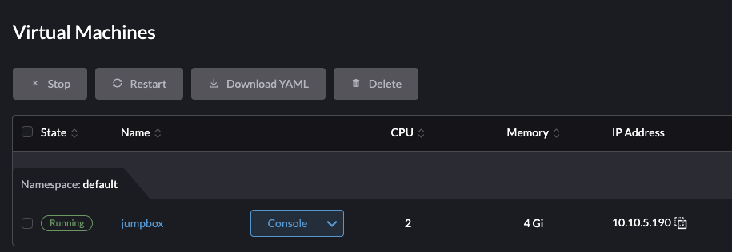
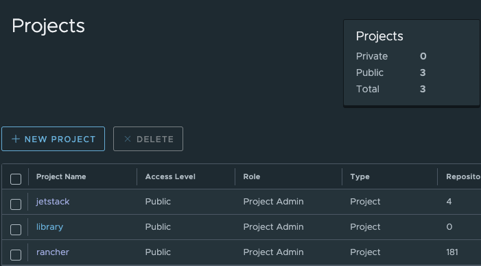
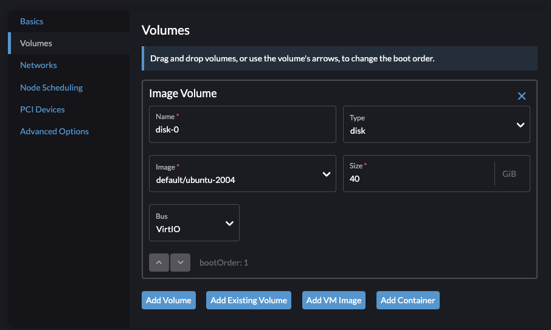
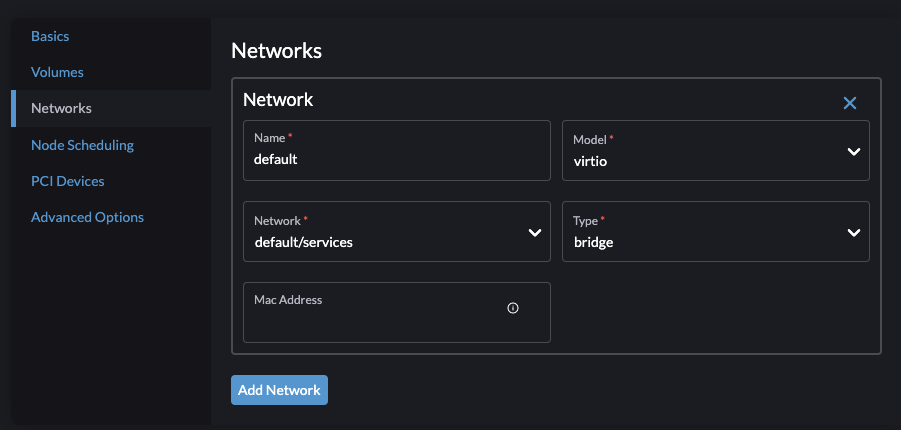
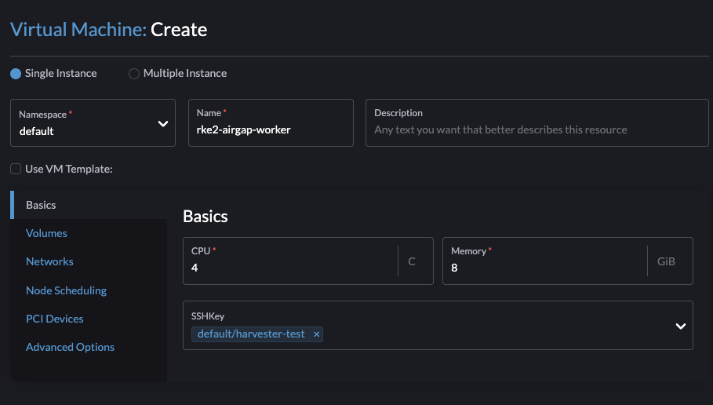
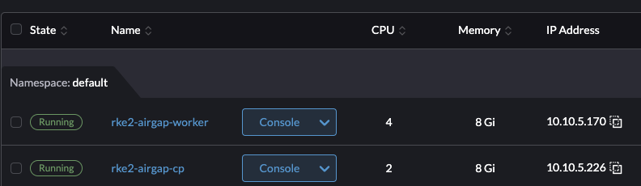
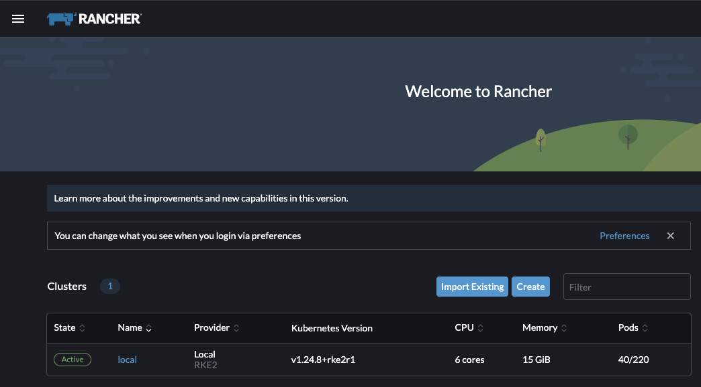

# Airgapping made easy with RKE2 and Rancher

## Intro

## Use Case and Scope

### What is an AirGap?
* Soft
* Hard

## Prereqs
* Infrastructure on which to deploy (we use Harvester here, but just about anything works) and that infra being configured.
* Linux or MacOS terminal with airgap access
* DHCP (static is possible, but adds extra provisioning steps)
* DNS
* Image Store (we use Harbor in our infrastructure)
* [RKE2 v1.24.8+rke2r1](https://github.com/rancher/rke2/releases/tag/v1.24.8%2Brke2r1) binaries
* [Rancher RCM 2.7.0](https://github.com/rancher/rancher/releases/tag/v2.7.0) binaries
* RKE2 Install Script
* kubevip

### Image Repo
When working in an airgap, it is necessary to bring all of your container images into a trusted source. This is usually called generically an `Image Store`. This location is a centralized source of truth that your RKE2 cluster, Rancher Cluster Manager, and all downstream clusters in this environment can pull their container images from (as opposed to the public cloud).

In order to do this, you'll need to pull down all of these images onto a local workstation and then either copy them into your softairgap via jumpbox or bring into your hard airgap using physical media like BluRay or a USB key drive. Be aware that the total image size is >30Gbi! The instructions for this process and some very helpful scripts are provided here.

## Manual
* Prep Environment
* Pull binaries
* Provision VMs
* SCP binaries and scripts into VMs
* Kick off control-plane node
* Kick off worker node
* Get kubeconfig
* Helm install Rancher

### Prep Environment
Prior to moving into the airgap, we need to prep our physical media with the binaries of everything we're going to need inside the gap. In a hard airgap, such as a SCIF, this will generally mean something like BluRay media; but in a soft airgap, it will involve pushing to a jumpbox of sorts that we have access to in that environment.

This demo is using a soft-airgap, so I'm going to pull the images and binaries down and then push them into the environment. I do this by creating an Ubuntu 20.04 jumpbox:


I then install some starter packages. These are a secret tool we'll need for later!
```bash
sudo snap install helm --classic
sudo snap install kubectl --classic
sudo snap install terraform --classic
wget https://github.com/sigstore/cosign/releases/download/v1.12.1/cosign-linux-amd64
sudo install cosign-linux-amd64 /usr/local/bin/cosign
rm cosign-linux-amd64
wget https://github.com/sunny0826/kubecm/releases/download/v0.21.0/kubecm_v0.21.0_Linux_x86_64.tar.gz
tar xvf kubecm_v0.21.0_Linux_x86_64.tar.gz
sudo install kubecm /usr/local/bin/kubecm
rm LICENSE README.md kubecm kubecm_v0.21.0_Linux_x86_64.tar.gz
git clone https://github.com/ahmetb/kubectx /opt/kubectx
sudo ln -s /opt/kubectx/kubectx /usr/local/bin/kubectx
sudo ln -s /opt/kubectx/kubens /usr/local/bin/kubens
wget https://github.com/mikefarah/yq/releases/download/v4.30.1/yq_linux_amd64
sudo install yq_linux_amd64 /usr/local/bin/yq
rm yq_linux_amd64
```

Once that's done, I'm going to copy my scripts from `bootstrap/airgap_scripts` into my jumpbox. We're using these scripts because they query the public release manifest for RKE2 and Rancher and pull the images and binaries necessary to bootstrap and run those things in an airgap. Otherwise, we'd be doing a LOT of container renaming and no one wants to do that kind of toil here.

```console
> scp -i ~/.ssh/harvester_test pull_rancher ubuntu@10.10.5.190:./
pull_rancher                                                                                                                100% 3022   292.7KB/s   00:00    
> scp -i ~/.ssh/harvester_test pull_rke2 ubuntu@10.10.5.190:./
pull_rke2                                                                                                                   100%  458   106.2KB/s   00:00    
> scp -i ~/.ssh/harvester_test push_images ubuntu@10.10.5.190:./
push_images                                                                                                                 100%  999   102.6KB/s   00:00    
```

After the scripts are in, we can run them with no parameters!

### Pull Binaries
Once my jumpbox is prepped and scripts copied, I can run them to begin pulling the images. Be aware there's about 30GB of images to pull, so do this on a high-speed connection!

RKE2:
```console
ubuntu@jumpbox:~$ ./pull_rke2 
--2022-12-15 19:50:47--  https://github.com/rancher/rke2/releases/download/v1.24.8+rke2r1/rke2-images.linux-amd64.tar.zst
Resolving github.com (github.com)... 140.82.114.3
Connecting to github.com (github.com)|140.82.114.3|:443... connected.
...
Saving to: ‘rke2-images.linux-amd64.tar.zst’

rke2-images.linux-amd64.tar.zst         100%[=============================================================================>] 774.73M  15.4MB/s    in 46s     

2022-12-15 19:51:33 (17.0 MB/s) - ‘rke2-images.linux-amd64.tar.zst’ saved [812363060/812363060]

--2022-12-15 19:51:33--  https://github.com/rancher/rke2/releases/download/v1.24.8+rke2r1/rke2.linux-amd64.tar.gz
Resolving github.com (github.com)... 140.82.114.3
Connecting to github.com (github.com)|140.82.114.3|:443... connected.
...
Saving to: ‘rke2.linux-amd64.tar.gz’

rke2.linux-amd64.tar.gz.1               100%[=============================================================================>]  46.11M  24.7MB/s    in 1.9s    

2022-12-15 19:51:35 (24.7 MB/s) - ‘rke2.linux-amd64.tar.gz.1’ saved [48350150/48350150]

--2022-12-15 19:51:35--  https://github.com/rancher/rke2/releases/download/v1.24.8+rke2r1/sha256sum-amd64.txt
Resolving github.com (github.com)... 140.82.113.3
Connecting to github.com (github.com)|140.82.113.3|:443... connected.
...
Length: 3626 (3.5K) [application/octet-stream]
Saving to: ‘sha256sum-amd64.txt’

sha256sum-amd64.txt.1                   100%[=============================================================================>]   3.54K  --.-KB/s    in 0.001s  

2022-12-15 19:51:35 (5.88 MB/s) - ‘sha256sum-amd64.txt.1’ saved [3626/3626]

```

Rancher:
```console
ubuntu@jumpbox:~$ ./pull_rancher 
"jetstack" has been added to your repositories
Hang tight while we grab the latest from your chart repositories...
...Successfully got an update from the "jetstack" chart repository
Update Complete. ⎈Happy Helming!⎈
Exporting quay.io/jetstack/cert-manager-cainjector:v1.8.1
Exporting quay.io/jetstack/cert-manager-controller:v1.8.1
Exporting quay.io/jetstack/cert-manager-webhook:v1.8.1
Exporting quay.io/jetstack/cert-manager-ctl:v1.8.1
Exporting rancher/aks-operator:v1.0.7
Exporting rancher/backup-restore-operator:v3.0.0
Exporting rancher/calico-cni:v3.22.0-rancher1
Exporting rancher/cis-operator:v1.0.10
Exporting rancher/coreos-kube-state-metrics:v1.9.7
Exporting rancher/coreos-prometheus-config-reloader:v0.38.1
Exporting rancher/coreos-prometheus-operator:v0.38.1
Exporting rancher/eks-operator:v1.1.5
Exporting rancher/externalip-webhook:v1.0.1
Exporting rancher/flannel-cni:v0.3.0-rancher6
Exporting rancher/fleet-agent:v0.5.0
...
Exporting rancher/system-upgrade-controller:v0.9.1
Exporting rancher/tekton-utils:v0.1.7
Exporting rancher/thanosio-thanos:v0.15.0
Exporting rancher/ui-plugin-operator:v0.1.0
Exporting rancher/webhook-receiver:v0.2.4
Exporting rancher/webhook-receiver:v0.2.5
Compresing Rancher images...
ubuntu@jumpbox:~$ ll /tmp/*.tar.gz
-rw-rw-r-- 1 ubuntu ubuntu   322077582 Dec 16 15:46 /tmp/cert-manager-images.tar.gz
-rw-rw-r-- 1 ubuntu ubuntu 77127547828 Dec 16 17:18 /tmp/rancher-images.tar.gz
```

The scripts drop the tarballed images into the /tmp directory. So if you are in the situation of a hard air-gap and need to copy these files, pull them from there and put them on physical media. In the demo soft airgap, I'm going to copy the binaries and rke2 install script over to the VMs as needed and push the container images to my local Harbor instance.

The `push_images` script is designed to consume the downloaded tarballs and push them to a target regsitry. Here we'll need to provide login credentials to our target internal registry. The syntax is: `./push_images my_registry_url my_username my_password source_tarball_file_location` 

First I'll push my cert-manager images, they require a `jetstack` project to exist if using Harbor so ensure you've created that. And in my case I am using a public-read-only registry. The same needs to be set for a `rancher` project.
```console
ubuntu@jumpbox:~$ ./push_images harbor.sienarfleet.systems admin 'my_password' /tmp/cert-manager-images.tar.gz 
auth.go:191: logged in via /home/ubuntu/.docker/config.json
===>Pushing harbor.sienarfleet.systems/jetstack/cert-manager-cainjector:v1.8.1
===>Pushing harbor.sienarfleet.systems/jetstack/cert-manager-controller:v1.8.1
===>Pushing harbor.sienarfleet.systems/jetstack/cert-manager-webhook:v1.8.1
===>Pushing harbor.sienarfleet.systems/jetstack/cert-manager-ctl:v1.8.1
```

Then I'll push rancher (will take a while):
```console
ubuntu@jumpbox:~$ ./push_images harbor.sienarfleet.systems admin 'my_password' /tmp/rancher-images.tar.gz 
auth.go:191: logged in via /home/ubuntu/.docker/config.json
===>Pushing harbor.sienarfleet.systems/rancher/aks-operator:v1.0.7
===>Pushing harbor.sienarfleet.systems/rancher/backup-restore-operator:v3.0.0
===>Pushing harbor.sienarfleet.systems/rancher/calico-cni:v3.22.0-rancher1
===>Pushing harbor.sienarfleet.systems/rancher/cis-operator:v1.0.10
===>Pushing harbor.sienarfleet.systems/rancher/coreos-kube-state-metrics:v1.9.7
...
===>Pushing harbor.sienarfleet.systems/rancher/system-agent-installer-rke2:v1.24.2-rke2r1
===>Pushing harbor.sienarfleet.systems/rancher/system-agent-installer-rke2:v1.24.4-rke2r1
===>Pushing harbor.sienarfleet.systems/rancher/system-agent-installer-rke2:v1.24.7-rke2r1
===>Pushing harbor.sienarfleet.systems/rancher/system-agent:v0.2.13-suc
===>Pushing harbor.sienarfleet.systems/rancher/system-upgrade-controller:v0.9.1
===>Pushing harbor.sienarfleet.systems/rancher/tekton-utils:v0.1.7
===>Pushing harbor.sienarfleet.systems/rancher/thanosio-thanos:v0.15.0
===>Pushing harbor.sienarfleet.systems/rancher/ui-plugin-operator:v0.1.0
===>Pushing harbor.sienarfleet.systems/rancher/webhook-receiver:v0.2.4
===>Pushing harbor.sienarfleet.systems/rancher/webhook-receiver:v0.2.5
```

Now that all container images have been pushed, I'll do a quick inspection of Harbor to ensure the artifacts are there.


### Provision VMs
We're going to keep the next step simple and create two VMs to run our RKE2 cluster and airgapped Rancher Cluster Manager install. Since this is the manual way, I need to create two VMs in Harvester. I'll make a control-plane node with 2 cores and 8Gbi of memory and a worker node with 4 cores and 8Gbi of memory.

See below for my control-plane node configuration. I'm creating two VMs in my Services VLAN so they will be assigned an IP in the 10.10.5/24 CIDR range.





Below is my worker node which has an identical config other than the core count and memory.



And now both VMs have started and hit my DHCP back-end for IP assignment.



### SCP binaries and scripts into VMs (Control Plane)
Next I'll hop into the VMs to ensure they are running and then copy the RKE2 binaries and RKE2 install script into them.

Once copied, I'll hop into the control-plane VM and create my `/etc/rancher/rke2/config.yaml` file. I explicitly add my hostname here as well as the VIP I intend to use, 10.10.5.4 is a static IP I use in my RCM cluster, and this will generate a TLS cert that accepts that SAN, avoiding any X509 errors. Worth noting here is the `system-default-registry` must be in a registry-format, so any `https` or `http` prefixes must be removed.
```yaml
token: my-shared-token
system-default-registry: harbor.sienarfleet.systems
tls-san:
- rke2-airgap-cp
- 10.10.5.4
```

Next I'm going to add some stuff to `/etc/hosts` to ensure I don't have any DNS issues.
```bash
sudo echo "127.0.0.1 rke2-airgap-cp" >> /etc/hosts
```

Next is adding a `/etc/rancher/rke2/registries.yaml` file to ensure that my RKE2 instance is setting up containerd mirroring to point at my internal Harbor instance:
```yaml
mirrors:
  docker.io:
    endpoint:
    - "https://harbor.sienarfleet.systems"
  harbor.sienarfleet.systems:
    endpoint:
    - "https://harbor.sienarfleet.systems"
```

Now I'll need to generate some static pod manifests for kube-vip by copying the rbac file and then generating the config from the script I pulled. Note where calling the kubevip script I am supplying my VIP address as well as the interface I wish it bound to. In Ubuntu this interface has defauled to enp1s0 for my VM in Harvester.
```console
ubuntu@rke2-airgap-cp:~$ ip addr
1: lo: <LOOPBACK,UP,LOWER_UP> mtu 65536 qdisc noqueue state UNKNOWN group default qlen 1000
    link/loopback 00:00:00:00:00:00 brd 00:00:00:00:00:00
    inet 127.0.0.1/8 scope host lo
       valid_lft forever preferred_lft forever
    inet6 ::1/128 scope host 
       valid_lft forever preferred_lft forever
2: enp1s0: <BROADCAST,MULTICAST,UP,LOWER_UP> mtu 1500 qdisc fq_codel state UP group default qlen 1000
    link/ether 32:cc:60:38:1d:d3 brd ff:ff:ff:ff:ff:ff
    inet 10.10.5.226/24 brd 10.10.5.255 scope global dynamic enp1s0
       valid_lft 1294634sec preferred_lft 1294634sec
    inet6 fe80::30cc:60ff:fe38:1dd3/64 scope link 
       valid_lft forever preferred_lft forever
```

```bash
sudo mkdir -p /var/lib/rancher/rke2/server/manifests/
sudo cp kube-vip-rbac.yaml /var/lib/rancher/rke2/server/manifests/
cat ./install_kubevip.sh |  vipAddress=10.10.5.4 vipInterface=enp1s0 sh | sudo tee /var/lib/rancher/rke2/server/manifests/vip.yaml
ll /var/lib/rancher/rke2/server/manifests/
```

Once the static manifests are present, we can kick off the RKE2 install using a local artifact directory. This will just install the binaries and serivce. After that we need to enable the service and start it:
```bash
sudo INSTALL_RKE2_ARTIFACT_PATH=/home/ubuntu sh install_rke2.sh
```

```console
ubuntu@rke2-airgap-cp:~$ sudo INSTALL_RKE2_ARTIFACT_PATH=/home/ubuntu sh install_rke2.sh
[INFO]  staging local checksums from /home/ubuntu/sha256sum-amd64.txt
[INFO]  staging zst airgap image tarball from /home/ubuntu/rke2-images.linux-amd64.tar.zst
[INFO]  staging tarball from /home/ubuntu/rke2.linux-amd64.tar.gz
[INFO]  verifying airgap tarball
grep: /tmp/rke2-install.u5eyvQnyMa/rke2-images.checksums: No such file or directory
[INFO]  installing airgap tarball to /var/lib/rancher/rke2/agent/images
[INFO]  verifying tarball
[INFO]  unpacking tarball file to /usr/local
```

Enable and star the service:
```bash
sudo systemctl enable rke2-server.service
sudo systemctl start rke2-server.service
```
```console
ubuntu@rke2-airgap-cp:~$ sudo systemctl enable rke2-server.service
Created symlink /etc/systemd/system/multi-user.target.wants/rke2-server.service → /usr/local/lib/systemd/system/rke2-server.service.
ubuntu@rke2-airgap-cp:~$ sudo systemctl start rke2-server.service
ubuntu@rke2-airgap-cp:~$
```

At this point, the control-plane node is starting. We can grab the kubeconfig from `/etc/rancher/rke2/rke2.yaml` and change its permissions to copy to our jumpbox.
```console
ubuntu@rke2-airgap-cp:~$ sudo cp /etc/rancher/rke2/rke2.yaml config
ubuntu@rke2-airgap-cp:~$ sudo chown ubuntu: config
```

Now copy the file down and change the API endpoint to our VIP
```console
ubuntu@rke2-airgap-cp:~$ exit
logout
Connection to 10.10.5.226 closed.
ubuntu@jumpbox:~$ scp -i ~/.ssh/harvester_test ubuntu@10.10.5.226:./config .
config                                                                                          100% 2969     6.4MB/s   00:00    
ubuntu@jumpbox:~$ mkdir .kube
ubuntu@jumpbox:~$ mv config .kube/
ubuntu@jumpbox:~$ sed -ie 's/127.0.0.1/10.10.5.4/g' .kube/config
```

Verify the control-plane node is running using `kubectl`:
```console
ubuntu@jumpbox:~$ kubectl get nodes
NAME             STATUS   ROLES                       AGE     VERSION
rke2-airgap-cp   Ready    control-plane,etcd,master   4m22s   v1.24.8+rke2r1
```

Now we can add the worker!

### Worker Join
The worker is nearly identical to the control-plane with a few exceptions. We need to ensure the `server` field is present and that the control-plane's hostname resolves so we'll cheat and add it to DNS. We'll also run the install slightly differently as workers only use the agent and not the full apiserver.

Ensure you copy everything over to the worker as well.

Here is our `/etc/rancher/rke2/config.yaml` file for the worker:
```yaml
token: my-shared-token
system-default-registry: harbor.sienarfleet.systems
server: https://rke2-airgap-cp:9345
```

The registries file is the same as above and the kubevip step can be skipped entirely. Now we just run the install script with the agent type toggled on:
```bash
sudo INSTALL_RKE2_ARTIFACT_PATH=/home/ubuntu INSTALL_RKE2_TYPE="agent" sh install_rke2.sh
```

Then we enable and run the service just as before:
```console
ubuntu@rke2-airgap-worker:~$ sudo systemctl enable rke2-server.service
Created symlink /etc/systemd/system/multi-user.target.wants/rke2-server.service → /usr/local/lib/systemd/system/rke2-server.service.
ubuntu@rke2-airgap-worker:~$ sudo systemctl start rke2-server.service
```

After this is finished, we should be successfully joined to the cluster. So let's hop back out to the jumpbox and verify using `kubectl`.
```console
ubuntu@rke2-airgap-worker:~$ exit
logout
Connection to 10.10.5.170 closed.
ubuntu@jumpbox:~$ kubectl get nodes
NAME                 STATUS   ROLES                       AGE   VERSION
rke2-airgap-cp       Ready    control-plane,etcd,master   16m   v1.24.8+rke2r1
rke2-airgap-worker   Ready    control-plane,etcd,master   58s   v1.24.8+rke2r1
```

Huzzah! We now have a control-plane node and cluster; we should be able to inspection the state of the pods:
```console
ubuntu@jumpbox:~$ kubectl get po -A
NAMESPACE     NAME                                                   READY   STATUS      RESTARTS   AGE
kube-system   cloud-controller-manager-rke2-airgap-cp                1/1     Running     0          17m
kube-system   cloud-controller-manager-rke2-airgap-worker            1/1     Running     0          107s
kube-system   etcd-rke2-airgap-cp                                    1/1     Running     0          16m
kube-system   etcd-rke2-airgap-worker                                1/1     Running     0          73s
kube-system   helm-install-rke2-canal-vn4j9                          0/1     Completed   0          17m
kube-system   helm-install-rke2-coredns-r48cv                        0/1     Completed   0          17m
kube-system   helm-install-rke2-ingress-nginx-9fs5v                  0/1     Completed   0          17m
kube-system   helm-install-rke2-metrics-server-fx95t                 0/1     Completed   0          17m
kube-system   kube-apiserver-rke2-airgap-cp                          1/1     Running     0          17m
kube-system   kube-apiserver-rke2-airgap-worker                      1/1     Running     0          107s
kube-system   kube-controller-manager-rke2-airgap-cp                 1/1     Running     0          17m
kube-system   kube-controller-manager-rke2-airgap-worker             1/1     Running     0          100s
kube-system   kube-proxy-rke2-airgap-cp                              1/1     Running     0          17m
kube-system   kube-proxy-rke2-airgap-worker                          1/1     Running     0          104s
kube-system   kube-scheduler-rke2-airgap-cp                          1/1     Running     0          17m
kube-system   kube-scheduler-rke2-airgap-worker                      1/1     Running     0          100s
kube-system   kube-vip-ds-h7hqc                                      1/1     Running     0          16m
kube-system   kube-vip-ds-jpfq5                                      1/1     Running     0          77s
kube-system   rke2-canal-9h5xl                                       2/2     Running     0          16m
kube-system   rke2-canal-kjmb8                                       2/2     Running     0          108s
kube-system   rke2-coredns-rke2-coredns-5cc9cf4f97-8bmqw             1/1     Running     0          16m
kube-system   rke2-coredns-rke2-coredns-5cc9cf4f97-9bppg             1/1     Running     0          101s
kube-system   rke2-coredns-rke2-coredns-autoscaler-c58946548-lnhvr   1/1     Running     0          16m
kube-system   rke2-ingress-nginx-controller-hzb9z                    1/1     Running     0          77s
kube-system   rke2-ingress-nginx-controller-w9w4h                    1/1     Running     0          16m
kube-system   rke2-metrics-server-6d49759bf5-h4dmm                   1/1     Running     0          16m
```

### Rancher Install

The next step is to install rancher itself, which should be a piece of cake. In this repo you'll find the rancher and cert-manager charts pulled down into tarballs, but if you don't you can grab them for yourself using helm (just make sure you have internet access)

```bash
helm repo add rancher-latest https://releases.rancher.com/server-charts/latest
helm repo add jetstack https://charts.jetstack.io
helm repo update
helm fetch rancher-latest/rancher --version 2.7.0
helm fetch jetstack/cert-manager --version 1.8.1
```

You'll be left with two helm chart tarballs `rancher-2.7.0.tgz` and `cert-manager-v1.8.1.tgz`.

Let's install cert-manager first using helm. Note in my example, I am referring to my harbor registry location that I pushed all my images to earlier. Yours will vary!
```bash
helm install cert-manager --create-namespace ./cert-manager-v1.8.1.tgz \
    --namespace cert-manager \
    --set installCRDs=true \
    --set image.repository=harbor.sienarfleet.systems/jetstack/cert-manager-controller \
    --set webhook.image.repository=harbor.sienarfleet.systems/jetstack/cert-manager-webhook \
    --set cainjector.image.repository=harbor.sienarfleet.systems/jetstack/cert-manager-cainjector \
    --set startupapicheck.image.repository=harbor.sienarfleet.systems/jetstack/cert-manager-ctl
```

Verify cert-manager is running:
```console
ubuntu@jumpbox:~$ kubectl get po -n cert-manager
NAME                                       READY   STATUS    RESTARTS   AGE
cert-manager-bbbbf6b84-knnx5               1/1     Running   0          97s
cert-manager-cainjector-64ccbb9549-8vmxr   1/1     Running   0          97s
cert-manager-webhook-68f548574b-x9rdn      1/1     Running   0          97s
```

Next install Rancher with a basic password. Ensure the URL provided in hostname maps to your previously-created (RKE2 step) kubevip VIP address.
```bash
helm install rancher --create-namespace ./rancher-2.7.0.tgz \
    --namespace cattle-system \
    --set hostname=rancher.home.sienarfleet.systems \
    --set certmanager.version=v1.8.1 \
    --set rancherImage=harbor.sienarfleet.systems/rancher/rancher \
    --set systemDefaultRegistry=harbor.sienarfleet.systems \
    --set bootstrapPassword=admin \
    --set ingress.tls.source=secret \
    --set useBundledSystemChart=true 
```

Verify Rancher is installing:
```console
ubuntu@jumpbox:~$ kubectl get po -n cattle-system
NAME                       READY   STATUS              RESTARTS   AGE
rancher-6dc7b67b7d-j6hzg   0/1     ContainerCreating   0          17s
rancher-6dc7b67b7d-kkrb5   0/1     ContainerCreating   0          17s
rancher-6dc7b67b7d-x7w5n   0/1     ContainerCreating   0          17s
```

It takes some time for Rancher to provision and install
```console
ubuntu@jumpbox:~$ kubectl get all -n cattle-system
NAME                                   READY   STATUS      RESTARTS   AGE
pod/helm-operation-68qsg               0/2     Completed   0          4m32s
pod/helm-operation-6h6dt               0/2     Completed   0          4m45s
pod/helm-operation-md9gs               0/2     Completed   0          4m59s
pod/rancher-6dc7b67b7d-j6hzg           1/1     Running     0          6m14s
pod/rancher-6dc7b67b7d-kkrb5           1/1     Running     0          6m14s
pod/rancher-6dc7b67b7d-x7w5n           1/1     Running     0          6m14s
pod/rancher-webhook-6954b76798-wvhwh   1/1     Running     0          4m30s

NAME                      TYPE        CLUSTER-IP      EXTERNAL-IP   PORT(S)          AGE
service/rancher           ClusterIP   10.43.42.40     <none>        80/TCP,443/TCP   6m14s
service/rancher-webhook   ClusterIP   10.43.62.187    <none>        443/TCP          4m30s
service/webhook-service   ClusterIP   10.43.137.110   <none>        443/TCP          4m30s

NAME                              READY   UP-TO-DATE   AVAILABLE   AGE
deployment.apps/rancher           3/3     3            3           6m14s
deployment.apps/rancher-webhook   1/1     1            1           4m30s

NAME                                         DESIRED   CURRENT   READY   AGE
replicaset.apps/rancher-6dc7b67b7d           3         3         3       6m14s
replicaset.apps/rancher-webhook-6954b76798   1         1         1       4m30s
```

I can now hop into my Rancher instance at `rancher.home.sienarfleet.systems` and set a password then view the dashboard!


Congrats! You've successfully installed an airgapped Rancher and RKE2 instance. You can stop here and pick up later. Or we can redo the VM provisioning in a much more slick fashion using Terraform.

## Terraform
* Build Harvester Images
* Get harvester kubeconfig
* Install via Terraform
